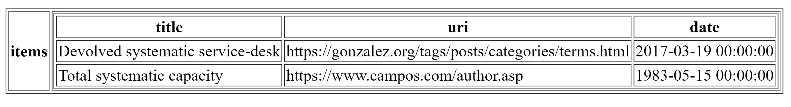
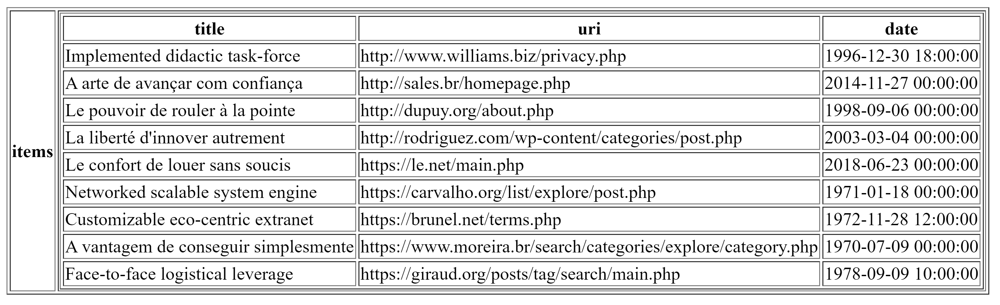
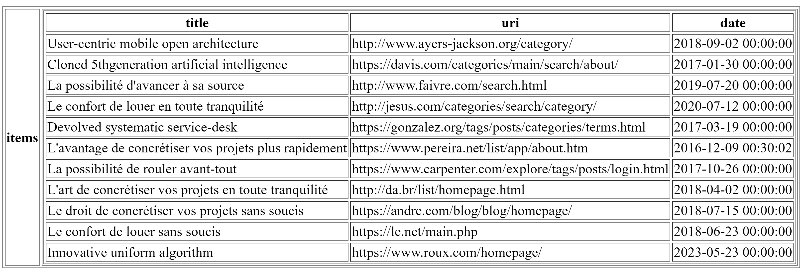
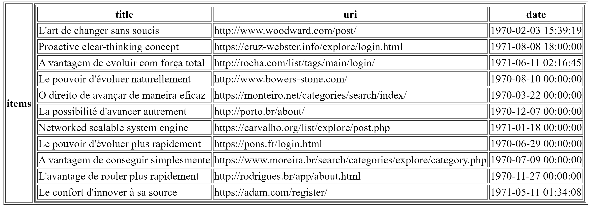
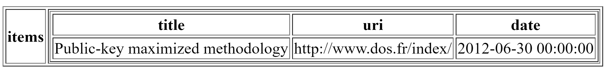

# Avaaz Engineering Exercise

To run this application, simply run:

```cli
$ docker compose up --build
```

The API container will start only after the database is ready.

You will need to populate the DB.
This can be done by sending JSON data to the `POST /ingest/json` endpoint of this API.

## Ingesting JSON data

The method I chose to populate the database using the provided JSON data was using Insomnia,
however a cURL command can be run that serves the same purpose.

```cli
$ curl localhost:5000/ingest/json \
    -X POST \
    -d @input/data.json \
    -H 'Content-Type: application/json'
```

## Debugging using VSCode and Docker

I provided some VSCode configuration files to run the project using VSCode's Docker integration.

The Docker integration can be a bit problematic sometimes, so if you encounter an error
such as "timeout" or similar, simply re-run the task until the homepage opens up in your browser.

Before running you need to start the database.
I also provided a startup script for the development database and isolated Docker network.
To run it, execute `./setup-dev-env.sh`.

## Tests

This section contains a few tests and screen captures.

### Main page

The main page is an extremely crude representation of the application.


### Queries

Each query is followed by its parameters and its result.

Search by title:

- Title: SYstEMATic



Search by URL:

- URL: .php



Search by date after:

- Date: 06-Oct-2015



Search by date before:

- Date: 31-Dec-1971



Search by date between:

- Start date: 07-Mar-2012
- End date: 07-Jun-2013

